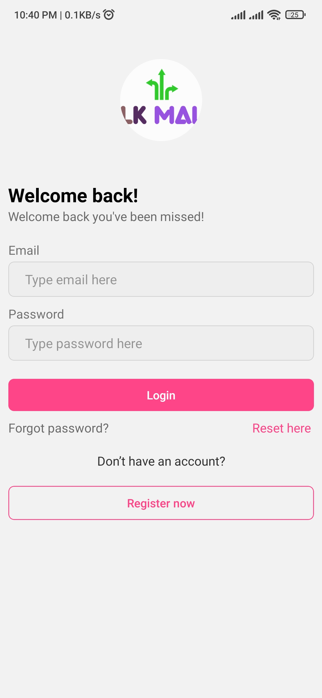
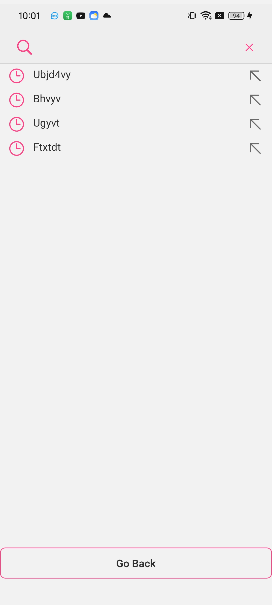
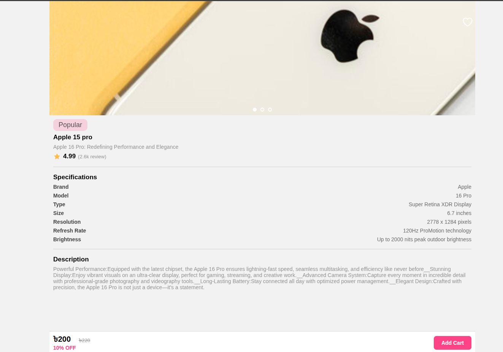
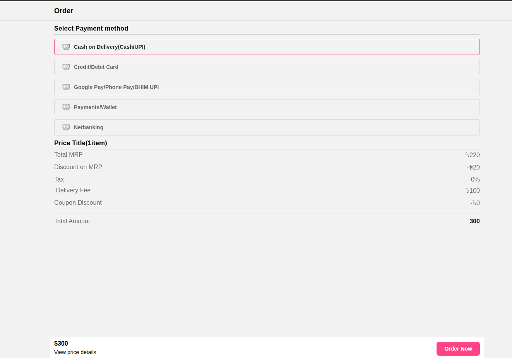
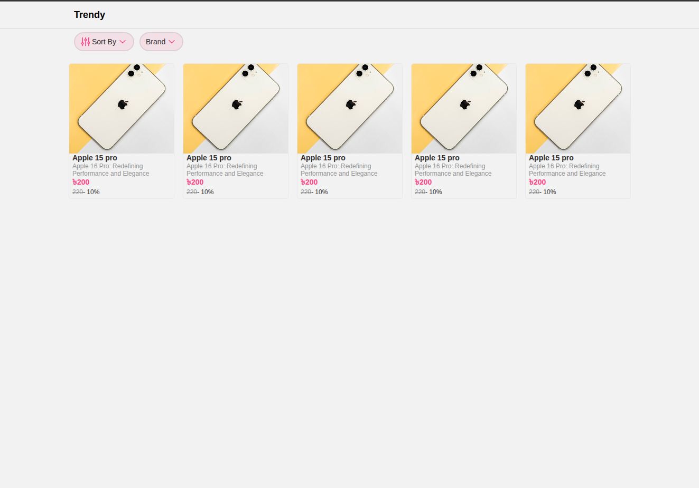
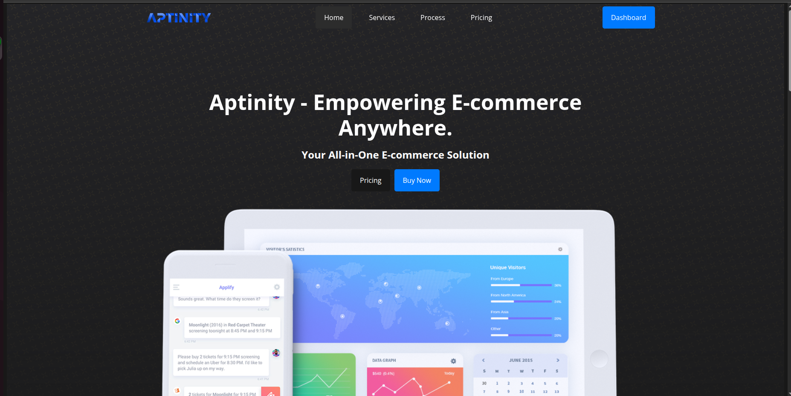

## 🛒 Multivendor eCommerce System

This is a **full-stack, scalable multivendor eCommerce platform** designed to support multiple shops under a single owner account. The system provides seamless functionality across web and mobile platforms and is built using modern technologies with CI/CD and Docker support for reliable deployment.


# Mobile Screens (Demo)
<br/>
<p>






</p>

# Web Page (Demo)
<br/>
<p>
    
    
    
    
    
    
    
</p>

# Dashboard Page (Demo)
<br/>
<p>

</p>

# Marketing Page (Demo)
<br/>
<p>



</p>


### 🧩 Key Components

| Layer              | Technology Stack                          | Description                                                                                                                      |
| ------------------ | ----------------------------------------- | -------------------------------------------------------------------------------------------------------------------------------- |
| **Backend API**    | [NestJS](https://nestjs.com/)             | Powerful Node.js framework structured with modules for managing shops, products, users, orders, and vendor-specific logic.       |
| **Database**       | [PostgreSQL](https://www.postgresql.org/) | Robust relational database with normalized schema to handle multivendor relationships, product inventories, and transactions.    |
| **Admin Panel**    | [ReactJS](https://react.dev/)             | A dynamic and responsive dashboard for owners and administrators to manage shops, vendors, orders, users, promotions, and more.  |
| **Marketing Site** | HTML, CSS, JavaScript                     | Lightweight, SEO-optimized landing/marketing page for the platform’s public-facing brand and vendor sign-up.                     |
| **Client App**     | [React Native (Expo)](https://expo.dev/)  | Cross-platform mobile and web app for customers to browse, shop, and place orders. Supports Android, iOS, and Web.               |
| **CI/CD**          | Docker, NGINX, GitHub Actions / GitLab CI | CI/CD pipeline to build, test, and deploy backend and frontend services in a containerized environment with NGINX reverse proxy. |

### 🌟 Features

* 🔗 **Multivendor Support** – One platform, multiple independent vendors/shops.
* 🛍️ **Shop & Product Management** – Each vendor can manage their own catalog.
* 📱 **Cross-Platform Client** – Built with React Native + Expo for Android, iOS, and Web.
* 📦 **Order & Inventory Management** – Real-time updates and vendor-specific logistics.
* 🎯 **Admin Control Panel** – Full oversight with role-based access.
* 🚀 **CI/CD + Dockerized** – Production-ready infrastructure with containerized services and automatic deployment support.
* 🌐 **Marketing Page** – Clean, static landing page for business visibility and SEO.

### 🛠️ Architecture Overview

```plaintext
┌────────────┐        ┌──────────────┐       ┌────────────┐
│ Marketing  │ <----> │  NGINX Proxy │ <---> │ Backend API│
│   Site     │        └────┬─────────┘       └────┬───────┘
└────────────┘             │                      │
                           │                      │
                  ┌────────▼─────┐       ┌────────▼────────┐
                  │   Dashboard  │       │   Mobile Client │
                  │   (React)    │       │  (React Native) │
                  └──────────────┘       └─────────────────┘
                                ↕
                            PostgreSQL DB
```


## ⚡ Quick Start

This project supports both **development** and **production** setups. Follow the guide below to get started quickly.

---

### 🔧 Development Setup

#### 1. Clone the Repository

```bash
git clone https://github.com/DeveloperRejaul/ecommerce-system.git
cd ecommerce-system
```

#### 3. Run Services Individually

* **Backend (NestJS)**

```bash
# 🔧 Development Setup Instructions

# 1. Enable hot-reloading for development:
#    Open your `compose.yml` file and locate the `server` service.
#    Under `volumes`, add the following line:
- ./server/src:/app/src  # 🔁 Sync local source code for live development

# 2. Start the project with build step:
docker compose up --build
```

* **Dashboard (ReactJS)**

```bash
cd dashboard
npm install
npm run dev

# For View goto this link
http://localhost:5173/dashboard
```

* **Client App (Expo)**

```bash
cd client
npm install
npm run dev
```

**PostgreSQL** and **pgAdmin** for GUI-based management.

**🚀 Access pgAdmin**

* URL: [http://localhost:5050](http://localhost:5050)
* Email: `admin@admin.com`
* Password: `pgadmin4`

**Add PostgreSQL Server in pgAdmin**

After login:

1. Go to **"Add New Server"**
2. Under **Connection** tab:

   * Host: `db`
   * Port: `5432`
   * Username: `postgres`
   * Password: `postgres`

---

**Create Default Owner User**

To enable login in the frontend, create a default `OWNER` user.

**Run this SQL in pgAdmin Query Tool**:

```sql
INSERT INTO public."Users" (
    id, name, email, phone, password, address, avatar, role, "shopId", "createdAt", "updatedAt"
) VALUES (
    '2221225f-6285-45bd-bfd3-4220fcf8ea2a', 
    'user', 
    'user@gmail.com', 
    '0123456789', 
    '$2b$10$w4p6QGfdWjxyNwXuZkryx.x5muucOSB2KmXC7O5X.IObTRbAFhLOm',  -- password: 123456
    'Dhaka, Bangladesh', 
    'https://example.com/avatar.jpg', 
    'OWNER', 
    NULL,  -- Set valid shopId if required
    '2025-02-03 12:00:33.507+06', 
    '2025-02-03 12:00:33.507+06'
);
```

* **Marketing Site (Static)**
  Open `index.html` in your browser or serve via live server / nginx locally.
